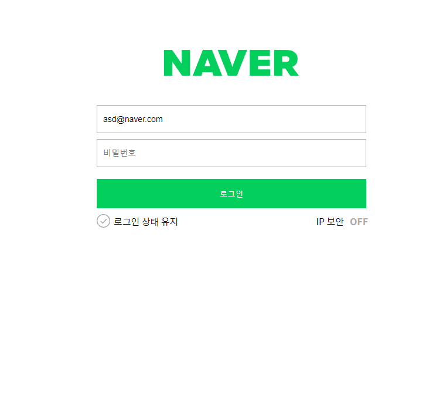
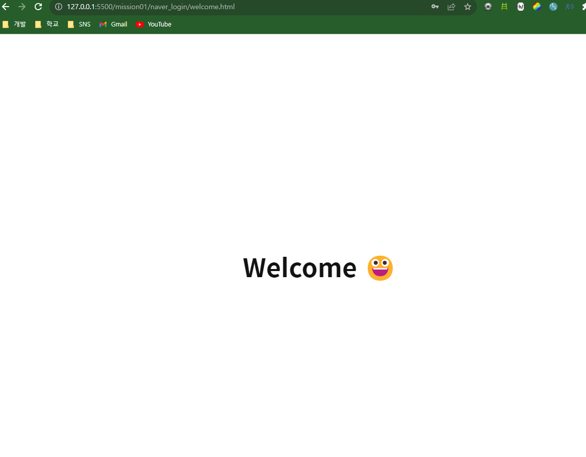

# 네이버 로그인 페이지 구현

---

로그인과 비밀번호를 정확히 입력했을 때 welcome 페이지로 넘어갈 수 있도록 코드 로직을 작성합니다.

---

- [x] 재사용 가능한 함수를 분리하고 함수를 중심으로 설계하는 방법에 대해 학습합니다.

## 코드

```
/*
  1. email 정규표현식을 사용한 validation
    - false면 해당 input에 is--invalid 클래스 추가
    - true 해당 input에 is--invalid 클래스 제거

  2. pw 정규표현식을 사용한 validation
    - false면 해당 input에 is--invalid 클래스 추가
    - true 해당 input에 is--invalid 클래스 제거

  3. 상태 변수 관리


  4. 로그인 버튼을 클릭시 조건처리

  */

// 1, 2. email, pw validation

function emailValid(text, node) {
  if (emailReg(text)) {
    node.classList.remove("is--invalid");
  } else {
    node.classList.add("is--invalid");
  }
}

function pwValid(text, node) {
  if (pwReg(text)) {
    node.classList.remove("is--invalid");
  } else {
    node.classList.add("is--invalid");
  }
}

function compareUser(user, input) {
  return user === input;
}

// 4. 클릭 시 로그인 버튼 처리

function handleEmail(e) {
  const tag = e.target;
  emailCheck = emailReg(tag.value);
  emailValid(tag.value, emailInput);
  visitor.id = tag.value;
}

function handlePw(e) {
  const tag = e.target;
  pwCheck = pwReg(tag.value);
  pwValid(tag.value, pwInput);
  visitor.pw = tag.value;
}

function handleBtn(e) {
  e.preventDefault();
  if (emailCheck && pwCheck) {
    if (user.id == visitor.id && user.pw == visitor.pw) {
      window.location.href = "welcome.html";
    } else {
      console.log("이메일이나 비밀번호가 틀렸습니다.");
    }
  } else {
    console.log("잘못 작성하셨습니다.");
  }
}

// 정규식

function emailReg(text) {
  const re =
    /^(([^<>()\[\]\\.,;:\s@"]+(\.[^<>()\[\]\\.,;:\s@"]+)*)|(".+"))@((\[[0-9]{1,3}\.[0-9]{1,3}\.[0-9]{1,3}\.[0-9]{1,3}\])|(([a-zA-Z\-0-9]+\.)+[a-zA-Z]{2,}))$/;

  return re.test(String(text).toLowerCase());
}

function pwReg(text) {
  const re = /^(?=.*[a-zA-Z])(?=.*[0-9])(?=.*[!@#$%^*+=-]).{6,16}$/;
  return re.test(String(text).toLowerCase());
}

// 객체

const user = {
  id: "asd@naver.com",
  pw: "spdlqj123!@",
};

const visitor = {
  id: "",
  pw: "",
};

// 변수 설정, 3. 상태 변수 관리
// 상태변수관리 하는 이유: 서버의 불필요한 일을 최소화하기 위해서
// 상태변수관리, 정규식이랑 비교했을 때 참 거짓 값을 받아서 둘다 값이 아닐 때는
let emailCheck = false;
let pwCheck = false;

const emailInput = document.querySelector(".user-email-input"); // 이메일 입력하는 부분 태그
const pwInput = document.querySelector(".user-password-input"); // 비번 입력하는 부분 태그
const btnTag = document.querySelector(".btn-login"); // 버튼 태그

// 이벤트 부여
emailInput.addEventListener("input", handleEmail);
pwInput.addEventListener("input", handlePw);
btnTag.addEventListener("click", handleBtn);

```

## 범쌤의 코드!

```
// 범쌤 코드

(function () {
  const user = {
    id: "asd@naver.com",
    pw: "spdlqj123!@",
  };

  /*
  1. email 정규표현식을 사용한 validation
    - false면 해당 input에 is--invalid 클래스 추가
    - true 해당 input에 is--invalid 클래스 제거

  2. pw 정규표현식을 사용한 validation
    - false면 해당 input에 is--invalid 클래스 추가
    - true 해당 input에 is--invalid 클래스 제거

  3. 상태 변수 관리


  4. 로그인 버튼을 클릭시 조건처리

  */

  const emailInput = document.querySelector("#userEmail");
  const pwInput = document.querySelector("#userPassword");
  const loginButton = document.querySelector(".btn-login");

  let emailPass = false;
  let pwPass = false;

  function emailReg(text) {
    const re =
      /^(([^<>()\[\]\\.,;:\s@"]+(\.[^<>()\[\]\\.,;:\s@"]+)*)|(".+"))@((\[[0-9]{1,3}\.[0-9]{1,3}\.[0-9]{1,3}\.[0-9]{1,3}\])|(([a-zA-Z\-0-9]+\.)+[a-zA-Z]{2,}))$/;

    return re.test(String(text).toLowerCase());
  }

  function pwReg(text) {
    const re = /^(?=.*[a-zA-Z])(?=.*[0-9])(?=.*[!@#$%^*+=-]).{6,16}$/;
    return re.test(String(text).toLowerCase());
  }

  function handleCheckEmail() {
    let value = this.value;

    if (emailReg(value)) {
      // success
      this.classList.remove("is--invalid");
      emailPass = true;
    } else {
      this.classList.add("is--invalid");
      emailPass = false;
    }
  }

  function handleCheckPw() {
    let value = this.value;

    if (pwReg(value)) {
      // success
      this.classList.remove("is--invalid");
      pwPass = true;
    } else {
      this.classList.add("is--invalid");
      pwPass = false;
    }
  }

  function handleLogin(e) {
    e.preventDefault();

    if (emailPass && pwPass) {
      const id = emailInput.value;
      const pw = pwInput.value;
      const getUserId = user.id; // 비동기 => 1s
      const getUserPw = user.pw; // 비동기 => 1s

      console.log(getUserId, getUserPw);

      if (id === getUserId && pw === getUserPw) {
        // console.log('로그인 성공!');

        window.location.href = "./welcome.html";
      }
    } else {
      console.log("입력부터 똑바로 하고와! ");
      // alert('dlqfurEhrqkfhgo!')
      gsap.to("form", {
        y: 10,
        repeat: 8,
        yoyo: true,
        duration: 0.08,
        clearProps: true,
      });
    }
  }

  emailInput.addEventListener("input", handleCheckEmail);
  pwInput.addEventListener("input", handleCheckPw);
  loginButton.addEventListener("click", handleLogin);
})();
```

## 실행 화면

- 로그인 화면
  

- user 정보와 일치할 시
  
